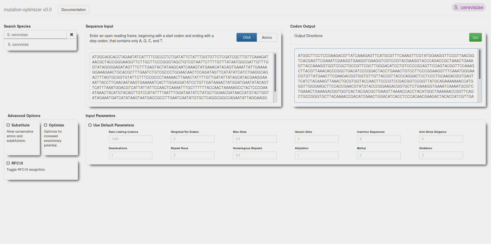

mutation-optimizer
==================

A [web interface](https://cosmicexplorer.github.io/mutation-optimizer), js translation, npm module, and executable for the original [mutation-optimizer script](lib/mutation-optimizer.py) written by Jarrod Shilts at Vanderbilt University.

# Dependencies
- [node and npm](https://nodejs.org/)
- [make](http://www.gnu.org/software/make/)

# Instructions

Run make. The site makes no external requests, so just open the local file "index.html" in your browser.

A more detailed documentation of the executable and upper-level api will be available when that is written.
